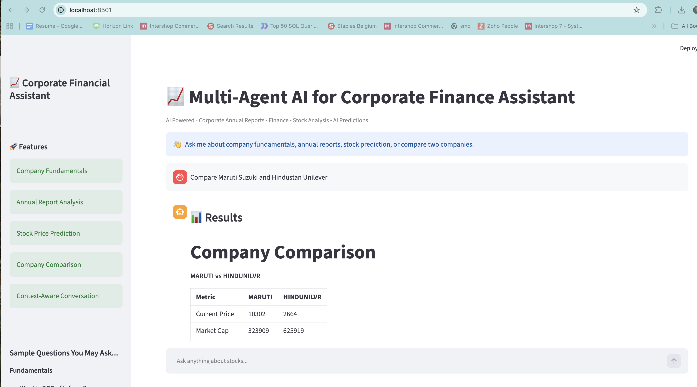
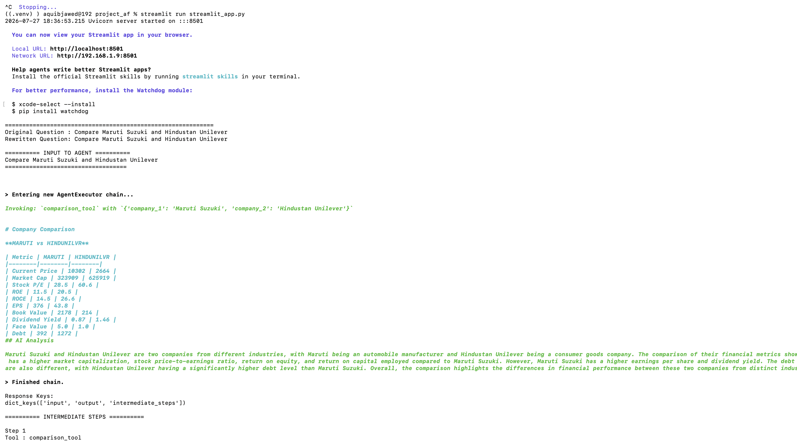

# Agentic AI For Finance

An AI-powered agentic AI platform for corporate financial analysis, annual report understanding, company fundamentals, stock prediction, and company comparison using LLMs, Retrieval-Augmented Generation (RAG), and Machine Learning.

Built with **Python, LangChain, Ollama, ChromaDB, Streamlit, XGBoost, and Joblib**.

---

# 🚀 Overview

Agentic AI platform enables users to interact with financial data using natural language.

Instead of relying on a single monolithic workflow, the application employs specialized AI tools that independently handle different financial tasks. A LangChain Tool Calling Agent analyzes the user's query and automatically invokes the appropriate tool for annual report analysis, company fundamentals, stock prediction, or company comparison.

The application combines Retrieval-Augmented Generation (RAG), Large Language Models, vector search, and Machine Learning to provide intelligent financial insights through an intuitive Streamlit interface.

---

## 📌 Project Highlights

- Designed a modular agentic AI architecture for financial analysis.
- Implemented Retrieval-Augmented Generation (RAG) using LangChain and ChromaDB.
- Built specialized AI agents for annual report analysis, financial fundamentals, company comparison, and stock prediction.
- Developed a context-aware conversational assistant capable of handling follow-up questions.
- Integrated local LLM inference using Ollama (Llama 3.1).
- Built an XGBoost-based stock price prediction pipeline with persisted models using Joblib.
- Developed an interactive Streamlit web application for financial question answering.

---

# ✨ Features

## 📄 Annual Report Analysis

Analyze corporate annual reports using Retrieval-Augmented Generation (RAG)

- Semantic search across company documents
- CEO Message
- Business Overview
- Risk Analysis
- Management Discussion & Analysis
- Sustainability Reports

---

## 📊 Company Fundamentals

Retrieve important financial metrics including:

- Revenue
- Sales
- EPS
- ROE
- ROCE
- Market Capitalization
- Book Value
- Dividend Yield
- Debt
- Cash Flow
- Current Price

---

## 📈 Stock Price Prediction

Machine Learning powered prediction module featuring:

- XGBoost Regression
- Feature Engineering
- Model persistence using Joblib
- Next Trading Day Price Prediction

---

## ⚖️ Company Comparison

Compare companies across multiple financial metrics.

Example:

- HDFC Bank vs ICICI Bank
- TCS vs Infosys
- Reliance vs Tata Motors

---

## 💬 Context-Aware Conversations

Supports follow-up questions through conversation context rewriting.

Example:

**User:** Summarize TCS annual report.

**User:** What are its risks?

The assistant understands that **"its"** refers to **TCS**.

---

# 🏗 Architecture

```text
                               User
                                  │
                                  ▼
                         Streamlit Web UI
                                  │
                                  ▼
                     Conversation Context Manager
                                  │
                          Question Rewriting
                                  │
                                  ▼
                     LangChain Tool Calling Agent
                                  │
      ┌──────────────┬──────────────┬──────────────┬──────────────┐
      │              │              │              │
      ▼              ▼              ▼              ▼
 Annual Report   Fundamentals   Prediction   Comparison
      Tool            Tool          Tool          Tool
      │               │             │             │
      │               │             │             │
      ▼               ▼             ▼             ▼
RAG Engine     Financial Data   XGBoost ML   Financial Metrics
      │               │             │             │
      ▼               │             ▼             │
Company Detector      │      Saved Model (.joblib)
      ▼               │
Chroma Vector DB      │
      ▼               │
Ollama (Llama 3.1)    │
      └───────────────┴─────────────┴─────────────┘
                                  │
                                  ▼
                          AI Generated Response
```

---

# 🛠 Technology Stack

## Language

- Python

## LLM & Agent Framework

- LangChain
- Ollama
- Llama 3.1

## Retrieval-Augmented Generation

- ChromaDB
- Nomic Embed Text
- PyMuPDF

## Machine Learning

- XGBoost
- Scikit-learn
- Pandas
- NumPy
- Joblib

## Frontend

- Streamlit

---

# 🔑 Key Skills

- Python
- LangChain
- Large Language Models (LLMs)
- Agentic AI
- Agentic Systems
- Retrieval-Augmented Generation (RAG)
- Prompt Engineering
- Ollama
- ChromaDB
- Vector Databases
- Semantic Search
- Embeddings
- Streamlit
- XGBoost
- Machine Learning
- Feature Engineering
- Joblib
- Pandas
- NumPy
- Scikit-learn
- Tool Calling Agents
- Conversational AI
- AI Assistants

---

# 📂 Project Structure

```text
.
├── agents/
│   ├── annual_report_agent.py
│   ├── fundamentals_agent.py
│   ├── comparison_agent.py
│   ├── prediction_agent.py
│   ├── langchain_agent.py
│   ├── router.py
│   └── tools.py
│
├── rag/
│   ├── rag_engine.py
│   ├── retriever.py
│   ├── company_detector.py
│   ├── llm.py
│   └── prompts.py
│
├── ml/
│   ├── predictor.py
│   ├── train_model.py
│   ├── feature_engineering.py
│   ├── data_loader.py
│   └── saved_models/
│
├── context/
├── config/
├── scripts/
├── ui_streamlit/
├── ui_images/
├── streamlit_app.py
└── requirements.txt
```

---

# 🧠 AI Components

| Component | Responsibility |
|-----------|----------------|
| LangChain Tool Calling Agent | Selects the appropriate tool based on user intent |
| Annual Report Tool | Answers questions from annual reports using RAG |
| Fundamentals Tool | Retrieves company financial metrics |
| Prediction Tool | Predicts next trading day stock price |
| Comparison Tool | Compares companies across financial metrics |
| Conversation Context Manager | Handles follow-up questions and conversational memory |

---

# 📸 Application Screenshots

## Streamlit Interface



### CLI Demonstration



---

# ⚙️ Installation

```bash
git clone https://github.com/afzalgithub1/finance-agentic-ai-Md_Afzal.git

cd <repository-name>

python -m venv .venv

# Windows
.venv\Scripts\activate

# macOS/Linux
source .venv/bin/activate

pip install -r requirements.txt
```

---

# ▶️ Run

```bash
streamlit run streamlit_app.py
```

---

# 📊 Sample Questions

## Annual Reports

- Summarize the annual report of Infosys.
- Explain TCS business strategy.
- What are the key risks mentioned in HDFC Bank's annual report?

## Fundamentals

- What is ROE of Infosys?
- Show EPS of TCS.
- What is the current market cap of Reliance?

## Prediction

- Predict Reliance stock price.
- Forecast TCS next trading day closing price.

## Comparison

- Compare Infosys and TCS.
- Compare HDFC Bank and ICICI Bank.

---

# 🎯 Core Concepts Demonstrated

- Agentic AI
- Tool Calling Agents
- Retrieval-Augmented Generation (RAG)
- Vector Search
- Semantic Retrieval
- Prompt Engineering
- Context Management
- Large Language Models (LLMs)
- Financial Data Analysis
- Machine Learning Pipeline
- Model Serialization
- Modular Software Architecture

---

# 🔮 Future Enhancements

- Multi-agent orchestration using LangGraph
- Real-time stock market APIs
- Financial News Agent
- Portfolio Analysis Agent
- Interactive Financial Dashboards
- Cloud Deployment
- Authentication & User Profiles
- Report Generation (PDF/Excel)